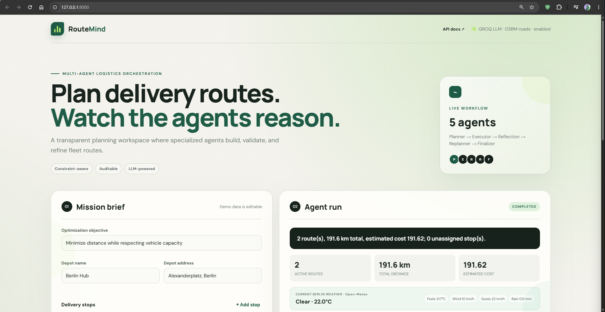
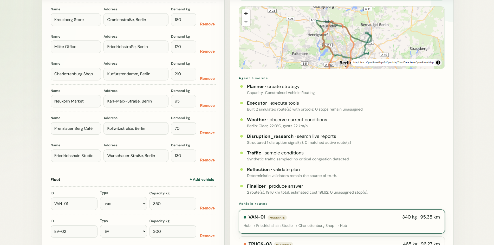
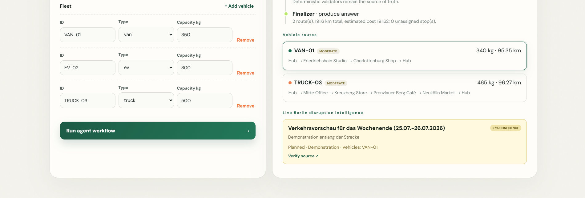
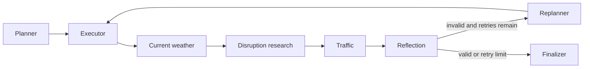

# RouteMind — Agentic Logistics AI

RouteMind is a full-stack starter for an LLM-assisted logistics planning system. A
group of specialized agents plans deliveries, executes deterministic routing
tools, validates constraints, replans when necessary, and returns an auditable
result to a web dashboard.

The application can run in deterministic demo mode with no API key, or use Groq
or OpenAI for the planning agent. Route calculations and validation stay
deterministic in every mode.

## What is included

- FastAPI backend with typed request/response models
- Planner, executor, weather, disruption-research, traffic, reflection, replanner,
  and finalizer agents
- Geocoding, fleet assignment, routing, policy retrieval, and tool registry
- Capacity and maximum-distance validators
- OR-Tools capacitated vehicle-routing optimization
- HERE/Google road-geometry decoding and traffic-provider adapters
- Dispatcher approval gates and plan comparison
- SQLite/PostgreSQL durable plan persistence
- Background traffic monitoring and server-sent events
- JSON logging, Prometheus metrics, and provisioned Grafana dashboards
- Deterministic agent tests and opt-in DeepEval evaluation with Groq
- JSON run checkpoints in `output/`
- Responsive browser dashboard with agent timeline and route metrics
- System design, architecture design, Mermaid diagrams, and tests

## Screenshots







## Quick start

```powershell
cd agentic-logistics-ai
python -m venv .venv
.\.venv\Scripts\Activate.ps1
pip install -r requirements.txt
Copy-Item .env.example .env
python app.py
```

Open [http://127.0.0.1:8000](http://127.0.0.1:8000). API documentation is
available at [http://127.0.0.1:8000/docs](http://127.0.0.1:8000/docs).

For macOS/Linux, activate the environment with `source .venv/bin/activate`.

## Enable a Groq-backed planner

Copy `.env.example` to `.env`, then add your key:

```dotenv
LLM_PROVIDER=groq
LLM_MODEL=llama-3.3-70b-versatile
GROQ_API_KEY=your-key
```

For a smaller, faster model, use `llama-3.1-8b-instant`.

## Enable an OpenAI-backed planner

Update `.env`:

```dotenv
LLM_PROVIDER=openai
LLM_MODEL=gpt-4.1-mini
OPENAI_API_KEY=your-key
```

The LLM proposes a planning strategy; assignments, distance calculations, and
constraint validation remain implemented as deterministic tools. This split is
important for reliability and testability.

## Real geocoding and road routes

The default `simulated` location provider requires no key and is intended only for
development. Select one real provider in `.env`.

### HERE

Create a HERE project and API key, then use:

```dotenv
LOCATION_PROVIDER=here
ROUTING_PROVIDER=here
HERE_API_KEY=your-here-key
```

The backend calls HERE Geocoding & Search to resolve addresses and HERE Routing v8
to calculate road distance and duration.

### Google Maps Platform

Create a billing-enabled Google Cloud project, enable **Geocoding API** and
**Routes API**, restrict the key to those APIs and your backend environment, then
use:

```dotenv
LOCATION_PROVIDER=google
ROUTING_PROVIDER=google
GOOGLE_MAPS_API_KEY=your-google-key
```

Google requires billing even when usage remains inside a monthly free allowance.
Set budget alerts and API quotas before testing.

### Is Tavily required?

No. Tavily is a web-search API, not a geocoding or road-routing provider. When
`TAVILY_ENABLED=true` and `TAVILY_API_KEY` is configured, the disruption agent
searches recent Berlin official and news sources for closures, construction,
demonstrations, accidents, breaking news, severe weather, strikes, supply-chain
problems, airport/rail interruptions, warehouse incidents, and diversions. The
LLM structures the reports, matches named locations to planned routes, and
retains source URLs and confidence. High-confidence active route matches require
dispatcher approval. Core planning works without Tavily.

These results are supporting intelligence, not authoritative road restrictions.
Verify the linked source. Production-grade automatic avoidance still needs
structured closure geometry from a traffic or routing provider.

### Current weather

The workflow retrieves current Berlin conditions from Open-Meteo without an API
key and displays temperature, apparent temperature, precipitation, wind, and
gusts. Deterministic rules mark thunderstorms, heavy precipitation/snow,
visibility below 500 metres, or gusts at/above `SEVERE_WIND_GUST_KMH` as severe.
Severe weather triggers replanning and dispatcher approval. Set
`WEATHER_ENABLED=false` for fully offline runs.

Development data is supplied by
[Open-Meteo](https://open-meteo.com/) under its applicable attribution and usage
terms.

## Free interactive map

The dashboard uses **MapLibre GL JS** with the no-key OpenFreeMap `liberty` style.
It displays route lines, stop positions, provider attribution, and the animated
vehicle marker without a Google or HERE map-display key.

This free basemap is a visualization layer only. Real address resolution requires
HERE, Google, or another geocoder. The development OSRM endpoint supplies
road-following route geometry but is not a production truck-routing service.
For a high-volume production deployment, review the tile provider's current terms
or self-host OpenFreeMap rather than assuming a community service has an SLA.

For the selected no-account configuration:

```dotenv
LOCATION_PROVIDER=simulated
ROUTING_PROVIDER=osrm
OSRM_BASE_URL=https://router.project-osrm.org
TRAFFIC_PROVIDER=synthetic
HERE_API_KEY=
GOOGLE_MAPS_API_KEY=
```

No HERE or Google account is required in this mode. OSRM returns road-following
geometry from OpenStreetMap data. The configured public endpoint is appropriate
for development and demos but has no availability guarantee; self-host OSRM for a
production service.

## PostgreSQL setup scripts

PostgreSQL setup and schema scripts are under `database/`:

```powershell
.\database\scripts\setup.ps1
.\database\scripts\verify.ps1
```

The setup script creates the application role, database, table, indexes, and
timestamp trigger without deleting existing data. See
[`database/README.md`](database/README.md) for parameters and troubleshooting.

## Synthetic traffic and replanning

Requests enable `simulate_traffic` by default. The traffic agent applies a
reproducible random congestion level to each route:

- clear
- light
- moderate
- heavy

Traffic adjusts estimated duration and delay. Heavy congestion raises a
`TRAFFIC_CHANGED` validation issue, invokes the LLM replanner, changes the stop
ordering, and reruns the route within `MAX_REPLANS`.

Use a repeatable scenario with:

```json
{
  "simulate_traffic": true,
  "traffic_seed": 42
}
```

Synthetic traffic is appropriate for demos, chaos testing, and validating agent
behavior. It must not be described as live traffic. For operations, replace it
with HERE Traffic, Google traffic-aware Routes, or another licensed traffic feed.

## API example

```bash
curl -X POST http://127.0.0.1:8000/api/plans \
  -H "Content-Type: application/json" \
  -d '{
    "depot": {"name": "Hub", "address": "Alexanderplatz, Berlin"},
    "stops": [
      {"name": "Store A", "address": "Kreuzberg, Berlin", "demand_kg": 120}
    ],
    "vehicles": [
      {"id": "VAN-01", "type": "van", "capacity_kg": 350}
    ]
  }'
```

## Project structure

```text
agentic-logistics-ai/
├── app.py                    # FastAPI application and endpoints
├── visualize.py              # Mermaid workflow export
├── config/                   # Environment settings and LLM adapter
├── models/                   # API schemas and shared workflow state
├── tools/                    # Deterministic capabilities and registry
├── agents/                   # Specialized agent implementations
├── services/                 # Event streaming and traffic monitoring
├── storage/                  # SQLAlchemy persistence repository
├── validators/               # Safety and feasibility checks
├── graph/                    # Workflow, conditional routing, checkpoints
├── visualization/            # Diagram and timeline helpers
├── frontend/static/          # Dashboard HTML, CSS, and JavaScript
├── docs/                     # Design, setup, roadmap, and screenshots
├── database/                 # PostgreSQL setup, schema, and verification
├── tests/                    # Unit and workflow tests
├── data/                     # Future policy/index datasets
└── output/                   # Generated plan checkpoints
```

## Agent workflow



## Development

```powershell
pytest -q
python visualize.py
```

`visualize.py` writes Mermaid source to `output/workflow.mmd`.

## Current scope and production roadmap

This learning project already includes OSRM road geometry, OR-Tools CVRP,
SQLite/PostgreSQL persistence, metrics, evaluation, current weather, disruption
research, streaming, and dispatcher approval. The principal production leftovers
are vehicle-specific legal road restrictions and environmental zones, structured
official closure geometry, provider road-time matrices, durable job workers,
authentication/tenancy, migrations, secret management, and centralized logs.

See [System Design](docs/SYSTEM_DESIGN.md) and
[Architecture Design](docs/ARCHITECTURE.md) for the full design. The prioritized
implementation backlog is in [Remaining Work](docs/REMAINING_WORK.md).
Provider, database, observability, and evaluation setup is documented in
[Production Setup](docs/PRODUCTION_SETUP.md).
