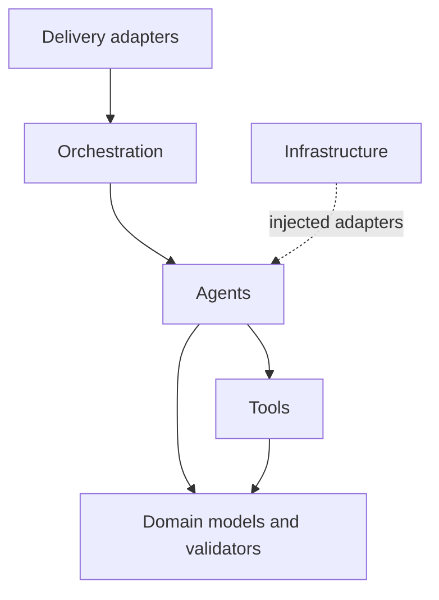

# Architecture Design

## Architectural style

The application uses a lightweight hexagonal architecture. FastAPI and the web
dashboard are inbound adapters; LLMs, map providers, storage, and retrieval systems
are outbound adapters. Agents contain orchestration policy, while tools contain
deterministic domain capabilities.

## Components

| Layer | Modules | Responsibility |
|---|---|---|
| Delivery | `app.py`, `frontend/static/` | HTTP API, validation boundary, user interface |
| Orchestration | `graph/` | Compiled LangGraph, conditional edges, retry budget, fallback checkpoints |
| Reasoning | `agents/` | Plan, execute, observe weather/disruptions, reflect, replan, summarize |
| Domain | `models/`, `validators/` | State, contracts, invariants, feasibility |
| Capabilities | `tools/` | Geocoding, routing, fleet assignment, policy retrieval, Tavily search, current weather |
| Infrastructure | `config/`, `storage/`, `services/`, `output/` | Provider configuration, SQL persistence, event streaming, fallback checkpoints |

## Dependency rules



- Domain code must not import FastAPI or frontend concerns.
- Agent code accesses external intelligence through `config.llm.LLMClient`.
- Tools return typed domain objects.
- Workflow code owns agent ordering and conditional transitions.
- LangGraph owns runtime node execution and the reflection-to-replanner/finalizer
  branch; domain agents remain framework-light async functions.
- Delivery code translates transport failures into HTTP responses.

## Agent responsibilities

### Planner

Interprets the objective, retrieves policies, and emits a structured strategy
contract using the configured LLM.

### Executor

Calls geocoding, capacity assignment, nearest-neighbor ordering, and route metric
tools. It should not decide whether a result is safe.

### Reflection

Runs deterministic validators, then uses the LLM to explain issues and recommend a
safe next action. The LLM cannot override validator failures.

### Traffic

Applies seeded synthetic congestion for development. It updates duration and delay,
emits a `TRAFFIC_CHANGED` issue for heavy congestion, and allows the normal
reflection/replanning loop to respond. A production adapter should replace the
simulator with live provider observations.

### Weather

Retrieves current Berlin conditions through the no-key Open-Meteo adapter.
Deterministic WMO-code, wind-gust, and visibility thresholds decide whether
conditions require replanning and dispatcher review.

### Disruption research

Uses Tavily to find breaking news, road closures, severe-weather alerts, strikes,
supply-chain problems, and other logistics disruptions. The LLM only structures
the supplied results. Source URLs are allowlisted against the actual search
response, confidence is retained, and active route matches enter the normal
validation and approval flow.

### Replanner

Uses explicit issue codes and the previous strategy to request a structured
recovery decision from the LLM. Only allowlisted recovery actions are applied.

### Finalizer

Produces a stable user-facing status and summary from verified state.

## Why LangGraph but not the LangChain package?

LangGraph is the appropriate orchestration layer for the stateful agent loop. The
application uses its `StateGraph`, `START`/`END` boundaries, async invocation, and
conditional edges. The higher-level LangChain package is not required for
OR-Tools, map providers, weather, traffic, Tavily, or deterministic validators.
`langchain-core` is present as a LangGraph dependency. Full LangChain components
should be introduced only for document ingestion, embeddings, vector retrieval,
and cited policy RAG.

## Storage

The application stores each plan through an async SQLAlchemy repository backed by
SQLite or PostgreSQL. It also writes a JSON checkpoint as a local fallback. The
server-generated run ID is used by `GET /api/plans/{run_id}`, approval records are
updated durably, and server-sent events expose live monitoring activity.

For production, introduce repositories:

```text
PlanRepository
  create_run(request) -> run_id
  save_state(run_id, state, version)
  get_run(run_id) -> PlanResponse
  list_events(run_id) -> list[AgentEvent]
```

Back the repository with PostgreSQL and use optimistic versioning so retried worker
messages cannot overwrite newer state.

## Security boundaries

- Treat user objectives and retrieved documents as untrusted prompt content.
- Permit only registered tools; never let model output select arbitrary functions.
- Validate all tool arguments against schemas.
- Keep provider secrets server-side.
- Add authentication and tenant authorization before exposing saved plans.
- Restrict CORS in non-development environments.
- Apply egress allowlists to external map and model providers.

## Extension points

- Add provider adapters behind `LLMClient`.
- Select HERE or Google through `LOCATION_PROVIDER` for real geocoding and routes.
- Use MapLibre with OpenFreeMap for a no-key visual basemap, or self-host tiles.
- Replace nearest-neighbor routing with a VRP solver.
- Replace local RAG policies with a vector repository.
- Add new agents by implementing `async run(state)` and wiring them in `graph/workflow.py`.
- Add streaming by emitting `AgentEvent` objects to an event bus.
