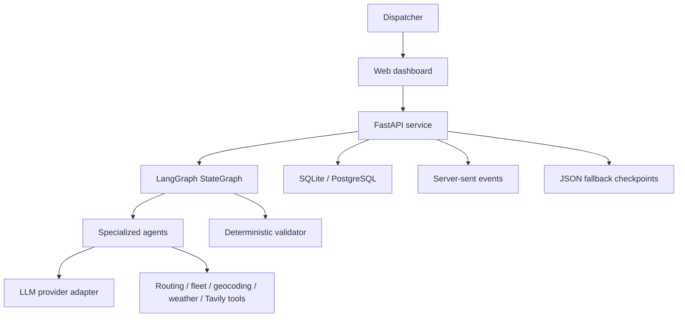
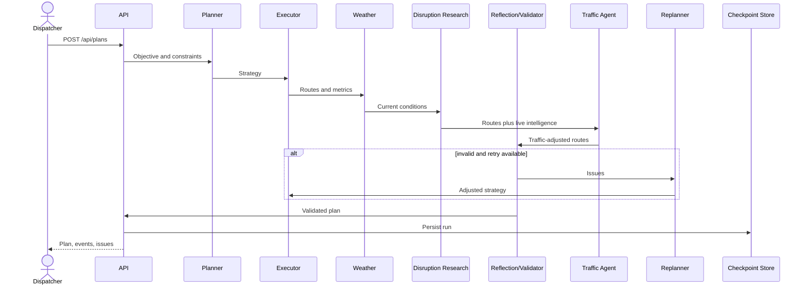

# System Design

## 1. Goals

The system converts a depot, delivery stops, fleet constraints, and a natural
language objective into validated vehicle routes. It should be transparent,
provider-independent, testable without an LLM, and safe against infeasible plans.

### Functional requirements

- Accept depot, stops, demand, fleet capacity, and optimization objective.
- Generate vehicle assignments and ordered routes.
- Validate capacity and maximum travel distance.
- Replan when validation finds a recoverable failure.
- Persist an auditable run with agent events and issues.
- Present results and workflow state in a browser.

### Non-functional requirements

- Deterministic constraint enforcement.
- Typed input validation and bounded request sizes.
- Swappable LLM and map providers.
- Graceful operation without external services.
- Traceability across every agent decision.

## 2. High-level design

The LLM influences strategy, not the truth of physical constraints. Tool outputs
and validators determine capacity, distance, and feasibility.

## 3. Request lifecycle

1. FastAPI validates the request with Pydantic.
2. LangGraph invokes the planner, which retrieves relevant policies and proposes
   a strategy.
3. The executor geocodes stops, assigns them by capacity, orders each route, and
   calculates route metrics.
4. The weather agent retrieves current Berlin conditions and applies deterministic
   severe-weather thresholds.
5. The disruption agent searches and structures breaking news, closures, severe
   weather alerts, strikes, and logistics disruption reports.
6. The traffic agent applies synthetic congestion or consumes provider traffic.
7. The reflection agent evaluates deterministic validation results.
8. A LangGraph conditional edge routes to the replanner while the retry budget
   remains, otherwise it routes to the finalizer.
9. The finalizer produces status and summary.
10. The service writes a durable database record plus a fallback checkpoint and
    returns the result.

## 4. Data model

- `PlanRequest`: depot, stops, vehicles, and objective.
- `LogisticsState`: mutable internal state shared by workflow nodes.
- `VehicleRoute`: ordered stops, legs, load, duration, distance, and cost.
- `ValidationIssue`: machine-readable code, message, and severity.
- `WeatherSnapshot`: current Berlin conditions and severe-condition decision.
- `DisruptionSignal`: sourced report, locations, confidence, and affected vehicles.
- `AgentEvent`: agent, action, summary, and timestamp.
- `PlanResponse`: final status, routes, issues, events, and run ID.

## 5. Reliability and safety

- Maximum 50 stops per synchronous request prevents accidental overload.
- Vehicle identifiers must be unique.
- Pydantic constrains coordinates, demands, capacities, and distances.
- Deterministic validators run after every execution attempt.
- Unassigned stops remain explicit in the response.
- A bounded replan count prevents infinite loops.
- LLM calls fall back to a deterministic strategy when disabled.
- Synthetic traffic is explicitly labeled and reproducible with a seed.
- Heavy congestion can trigger bounded alternate-order replanning.
- Severe weather and high-confidence active disruption matches require dispatcher
  approval; Tavily reports remain untrusted until their linked source is verified.

For production, add timeouts and retries around every external provider, circuit
breakers, idempotency keys, a durable job queue, and human approval thresholds.

## 6. Scaling design

The current synchronous design is appropriate for a local prototype. At larger
scale, split it into:

- API service for validation and job submission.
- Worker pool for agent workflows and solver jobs.
- PostgreSQL for operational state and audit history.
- Redis or a managed queue for job delivery and progress events.
- Object storage for larger artifacts.
- WebSocket or server-sent events for live timeline updates.

Partition data by tenant and region. Cache geocoding and distance matrices because
they are expensive and highly reusable.

## 7. Observability

Track:

- Request and run IDs across logs.
- Agent and tool latency.
- LLM model, tokens, cost, and fallback rate.
- Validation and replan frequency.
- Unassigned-stop rate and route cost.
- External-provider error and cache-hit rates.

Never log API keys, full customer instructions, or sensitive delivery addresses
without an explicit retention and redaction policy.
